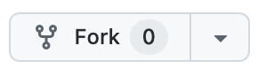
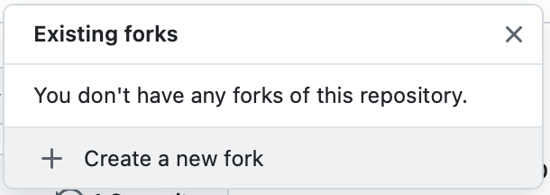
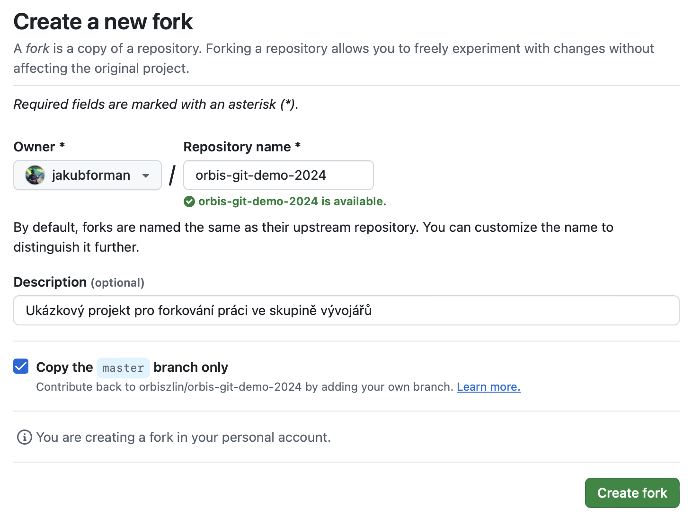
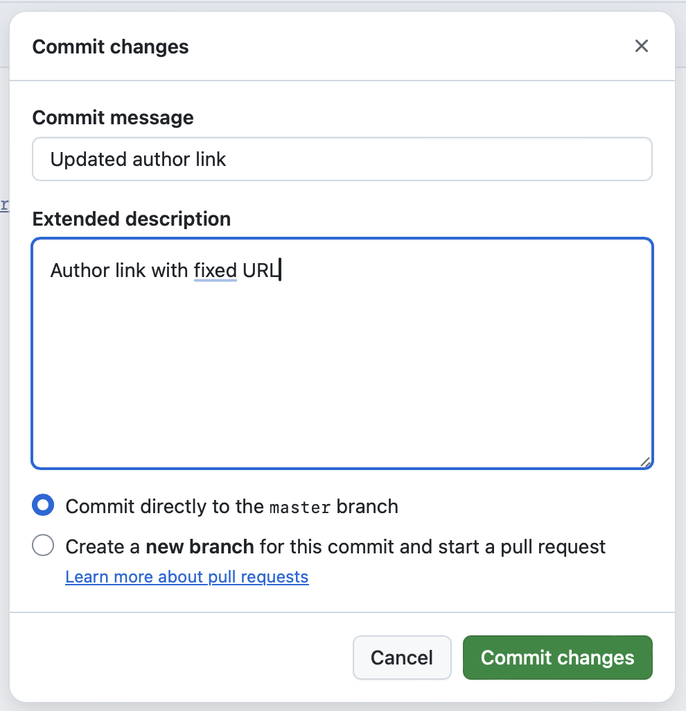

# Orbis Git Demo projekt

## Forks

> To be able to collaborate on Open-Source projects, you need to create forks, which are a "copy" of the repository in your GitHub account in your repository.
> 

**How to fork**

1. Click on the fork button located at the top of the repository menu 
2. In the dialog box click on create if it is not already created, otherwise click on our existing fork 
3. Creating a fork in confirmation with settings 
4. Code editing at the IDE level or quick editing in GitHub

**Commit dialogs**

> Always fill in dialogs with the truth and exactly what happened in the code. Every forgotten thing can mean a problem in the future (even in the horizon of years), what was actually created where.

## Contributors

- [Ing. Jakub Josef Forman](https://github.com/jakubforman)
- [Jiří Dresler](https://github.com/Kernepult1).
- [Jáchym Vlček](https://github.com/KamoNedavamTo)
- [Václav Pátík](https://github.com/feltwine) .*.*>>
- [Tadeáš Mikeška](https://github.com/teddv8)
- [Jakub Zámečník](https://github.com/jackkybl).!!!!;;
- [Tomáš Závodský](https://github.com/Zavodskyy) ?!?
- [Adam Kunorza](https://github.com/Ady1s)
